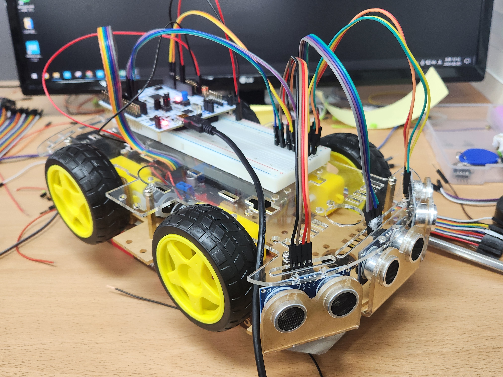

# autonomous_car

초음파센서를 이용한 자율주행차량을 개발하였습니다. STM32를 이용해 제어하였고 초음파센서 3개를 통해 데이터를 얻고 DC모터, LCD를 제어하였습니다. 타이머, 인터럽트, RTOS, I2C, 블루투스 등을 활용하였습니다.

# 제작한 자율주행 자동차

# 자율주행 영상

https://youtu.be/2ns1jWKX29g

# 세부사항 및 포트폴리오

## 동작원리

1. 블루투스 어플리케이션을 통해 수동모드와 자동모드를 선택합니다.

2. 수동모드는 모터의 전진, 후진, 좌회전, 우회전을 조절할 수 있고 자동모드는 왼쪽, 정면, 오른쪽을 초음파센서로 거리를 측정해 상황에 맞게 모터를 동작시킵니다.

3. 초음파센서의 10us만큼 high신호를 trig핀에 주면 초음파 신호가 나가고 그 순간 echo핀이 high가 됩니다. 그후 초음파신호가 다시 돌아오면 echo핀이 low가 되서 high가 유지되었던 시간을 측정해서 거리를 계산합니다. 이 트리거 신호를 RTOS의 1번 테스크에 넣었습니다.

4. I2C 통신으로 LCD에 현재 전진, 후진, 우회전, 좌회전 상태를 표시해줍니다. LCD 데이터시트를 활용하여 LCD 함수를 직접 구현하였습니다.

## 결과

1.높은 PWM주파수로 인한 과전류
   
-> 모터의 소음 및 진동 문제를 해결하기 위해 20kHz의 PWM주파수를 인가하였습니다. 결과적으로 과전류 문제로 인해 모터드라이버가 고장이 났습니다.

-> 모터 드라이버의 노이즈 개선 부품이 부족하였고 모터의 스펙을 정확하게 알 수 없는 상태에서 높은 주파수를 인가하여 발생한 문제라 판단하였습니다. 이를 통해 하드웨어의 스펙과 문제 방지 대책을 확실히 구비하였을 때 성능을 높일 수 있다고 생각했습니다.

2.논블로킹을 위해 통신을 모두 DMA방식으로 구현

-> 블루투스를 위한 UART의 경우 DMA방식으로 구현하였으나 LCD사용을 위한 I2C의 경우 폴링방식으로는 LCD가 정상동작하였으나 DMA방식으로 구현하니 LCD에 데이터가 제대로 전달되지 않았습니다.

-> LCD에 2바이트를 한번에 보내면 안되고 한 바이트 씩 보내야 제대로 전송이 되는데 DMA 방식의 경우 첫번째 바이트는 정상적으로 전달이 되었으나 두번째 바이트가 제대로 전달되지 않는 현상을 발견하였습니다.

-> 그래서 1바이트를 보낸후 폴링방식때 처럼 바로 다음 바이트를 보내는게 아닌 딜레이를 중간에 줘서 데이터를 전송할 시간을 보장해주니 DMA를 구현할 수 있었습니다.

-> 그리고 BLDC 모터 컨트롤러 때는 통신을 사용하지 않았기 때문에 AVR에서 UART, I2C를 사용한 LCD, SPI를 구현해보며 레지스터 설정법을 추가로 공부하였습니다.

3.라운드로빈방식으로 RTOS를 구현

-> 전체적인 코드를 모듈형식으로 나누고 모두 인터럽트를 활용하는 방식으로 논블로킹을 구현하였습니다. 이제 RTOS의 여러 테스크 안에 각각의 인터럽트 트리거를 위한 함수들을 실행하는 식으로 코딩하였습니다.

-> 초음파센서를 위한 테스크와 모터를 위한 테스크에는 osDelay(50)를 주고 LCD에는 osDelay(500)으로 해서 더 많은 빈도로 모터와 초음파센서가 동작하게 끔 하였습니다.

